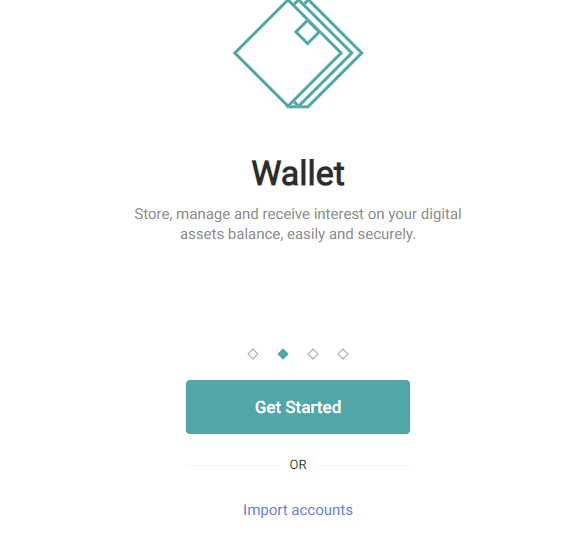
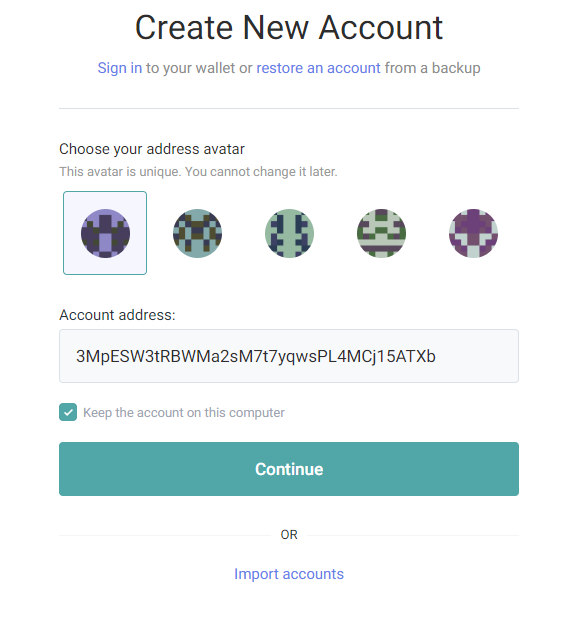
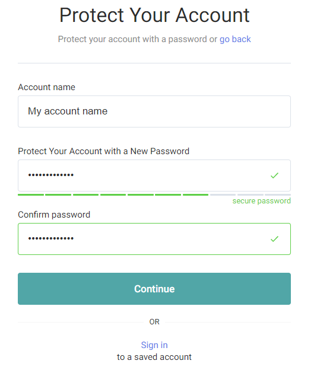
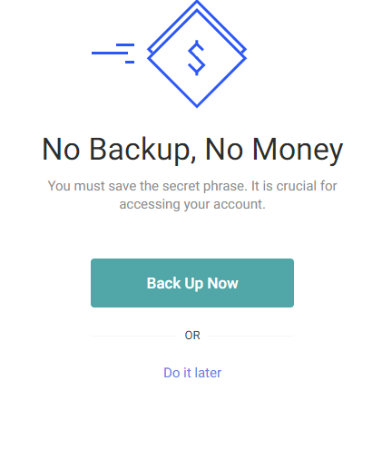
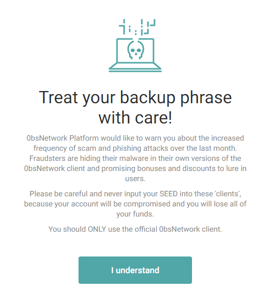
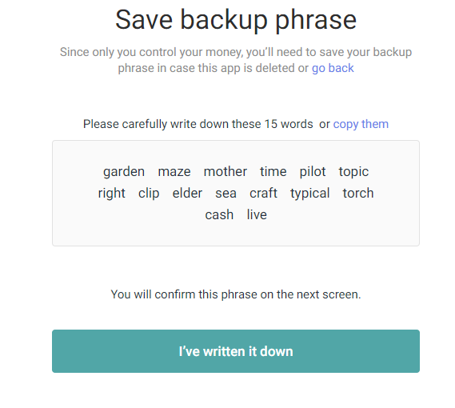
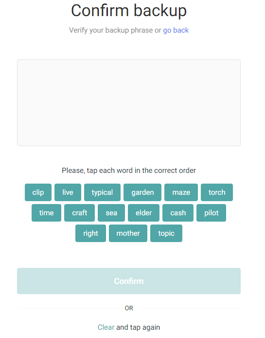
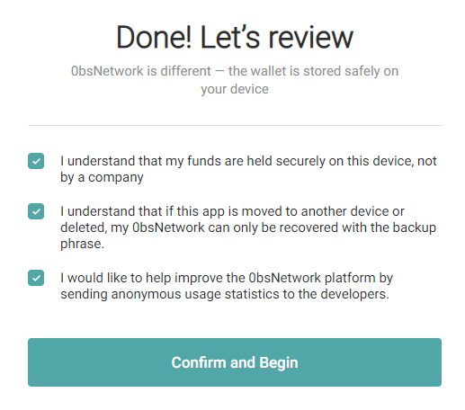
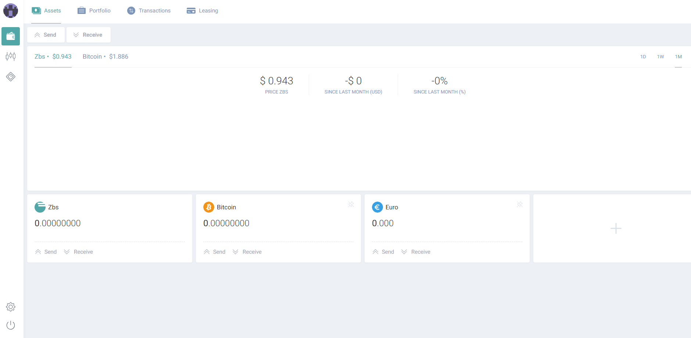
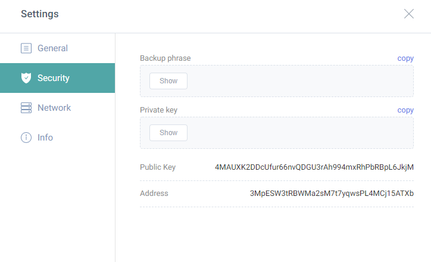

# Creating your wallet

Account creation

You can use online version of the client for now, standalone version for Mac, PC or Linux are coming soon!Online version of the client can be found here - [Online client](https://client.testnet-0bsnetwork.com/) **Pay attention!**Please take some time to understand some important things for your own safety. We cannot recover your funds or freeze your account if you visit a phishing site or lose your backup phrase \(aka **SEED** phrase\). By continuing to use our platform, you agree to accept all risks associated with the loss of your **SEED**, including but not limited to the inability to obtain your funds and dispose of them. In case you lose your **SEED**, you agree and acknowledge that the 0bsnetwork Platform would not be responsible for the negative consequences of this. Once you've read and understood the above, click on **Get Started** to proceed with your account creation!   

 

Choose your address avatar, once you've done that, choose **Continue**.  

 Now it's time to choose your account name and a secure password. Repeat your secured password and choose **Continue**.  

Now, the most important step for you comes. Backup your account, choose **Back Up Now.**  

Pay attention to the warning and read it carefully. Only after that, click **I understand.**  

Here comes the **SEED**. It's your one and only way to accessing and restoring your wallet. **DO NOT** share it with anyone else than official **0bsnetwork** **client**.The best and most secure way for you to save your **SEED** is to write it down on piece of paper and keep it somewhere secure. **DO NOT** store the backup phrase on any unencrypted electronic devices or you risk of getting your wallet and your funds compromised. 0bsnetwork client will ask you to confirm your backup phrase in next step. After you've written it down, click on **I've written it down** and proceed.  

Confirm your backup seed with a correct sequence of words \(Your words are bellow the box, just click on them\). If you make a mistake, just click on **Clear** and start it over again.  

 This is the last step, read and understand the terms and if you agree, tick the checkboxes and click on **Confirm and Begin.**   

 Now, if you completed all of the above steps, you should see an interface like this. This is your dashboard. Congratulations!  

## Warning - SEED phrase

You can access your **SEED** phrase from your dashboard once you're logged in **!!!**

Keeping your **SEED** secure is the only way to access and restore your wallet and your funds, so be careful and don't lose it!**!!!** 

In the bottom left corner, there's a **Settings** icon  ****

In the window that opens, click on the **Security** and then click on **Show** under **Backup phrase.**   

