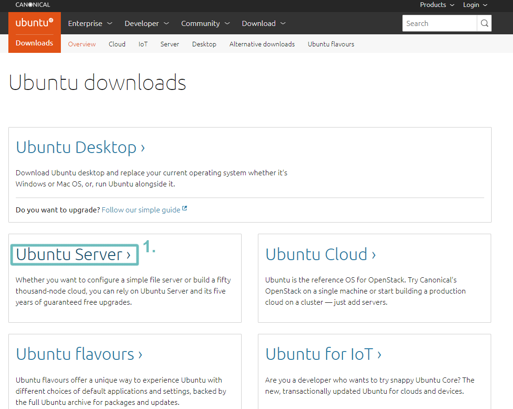
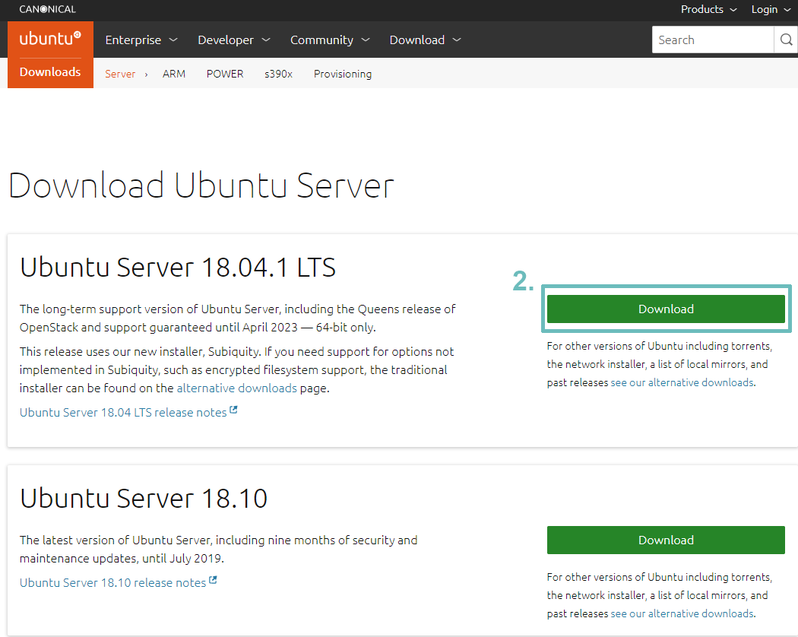

# Downloading Ubuntu Server ISO

First of all, you will need Ubuntu Server installed. 

You can download the ISO from the Ubuntu official website: [Ubuntu Download](https://www.ubuntu.com/download) 

1. Click on Ubuntu Server, it will lead you to the next page, shown on next picture   ​  
  

 2. Now click on the green ‘Download’ button to start the download of Ubuntu Server ISO    
  
  

Once the download is finished, it’s time to burn that ISO to a USB Drive, which I’ll show you how to do in next section. 

