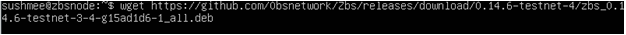
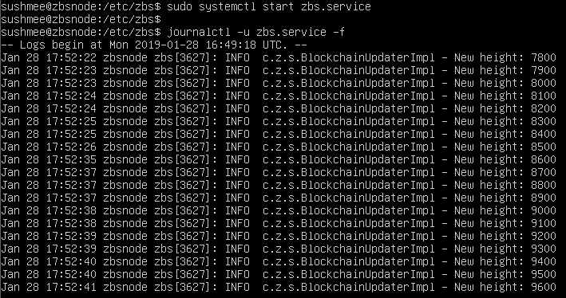
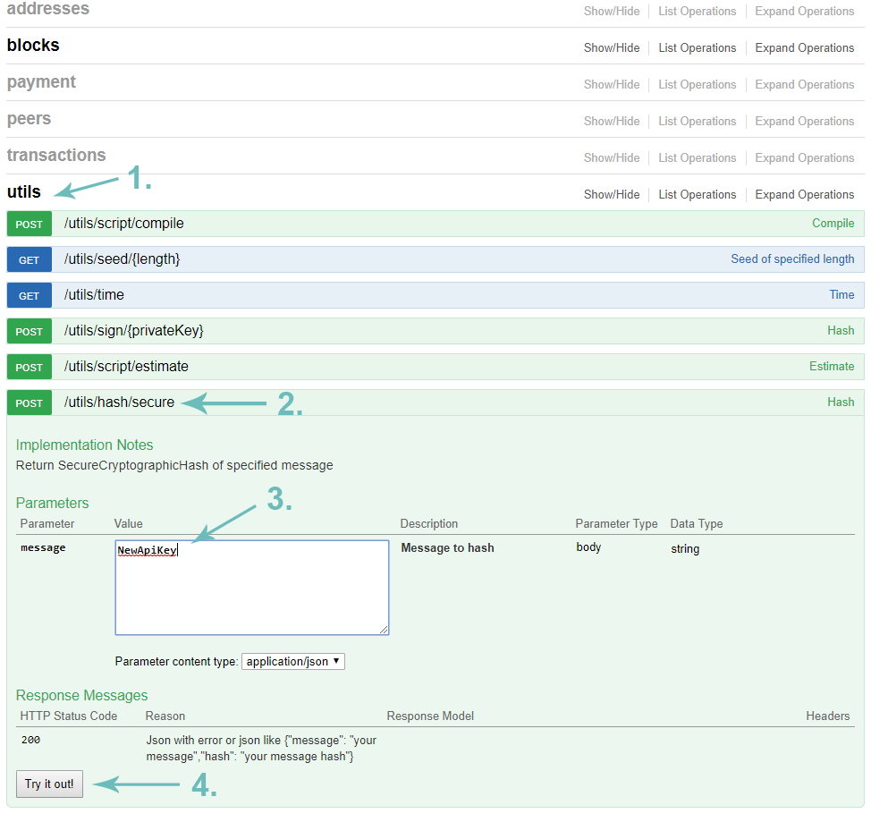

# Installing the ZBS Node and prerequisites

1. Before everything, we need to install Java 8. \(For now, only Java 8 is supported\). Enter this into your command line: **sudo add-apt-repository -y ppa:webupd8team/java** 

2. After that is done, enter this: **sudo apt-get update** 

3. Next is this line: **sudo apt-get -y install oracle-java8-installer** \(It will prompt you for Terms of Use, accept them\) 

4. Now, check if it’s the correct Java version with: **java -version** \(You should get text like this\)    

5. Go to this 0bsnetwork Github to download latest .deb file for our Node: [Link](https://github.com/0bsnetwork/Zbs/releases) 

Right-Click on the latest .deb file and click on ‘Copy Link Address’  

 ​  

6. Enter this command with the link you’ve just copied to your command line: **wget link**  

  
​  

7. Once that’s downloaded, we’re gonna install it using depackage \(dpkg\):  

  
​  

8. Now we’re gonna navigate where the node package is installed using: **cd /etc/zbs** 

9. Let’s edit the node config file now: **sudo nano zbs.conf** 

10. You will get this config file opened, change ‘node-name’ with your desired name and change the ‘password’ to your desired one:  

 ​  

11. Enable node’s REST API by editing the line ‘enable = yes’  

 ​  

12. Once you’re done, press Ctrl + X to exit and save the config file. 

13. Start your 0bs node service with this line: **sudo systemctl start zbs.service** 

14. Now to check out how’s our node running, type this into the command line:  

**journalctl -u zbs.service -f** 

You should get something like this:  

 ​  

If it looks like this, it means your node is up, running and downloading latest blocks! Now there are few more steps before we end the setup. 

15. Open up your browser and type this into your search bar: **localhost:7431**  

 ​  

16. Now click on ‘utils’, then on ‘/utils/hash/secure’ 

In the white box, type NewApiKey and press ‘Try it out’ on the bottom to get your secure API hash.  

 ​  

17. Copy your API Hash and let’s get back to your terminal.  

 ​  

18. Open up the Node config file again with: **sudo nano zbs.conf** and edit ‘api-key-hash’ with the hash you just copied. Save and close the config file and restart your node service with:  

**sudo systemctl restart zbs.service**  

Congratulations, you now have your 0bs Node up and running!  

