# Installing Ubuntu Server

1. Once you booted from the USB drive you just made, let it load until you get to this screen,press ‘Enter’ select your language. I’m going with English here:  

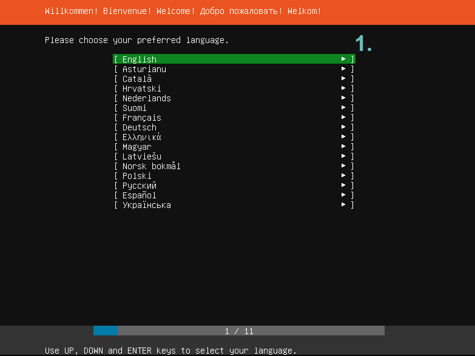

2. Now you have to select your Keyboard Layout. I’m leaving this at default and proceeding further. \(These settings are up to you\)  

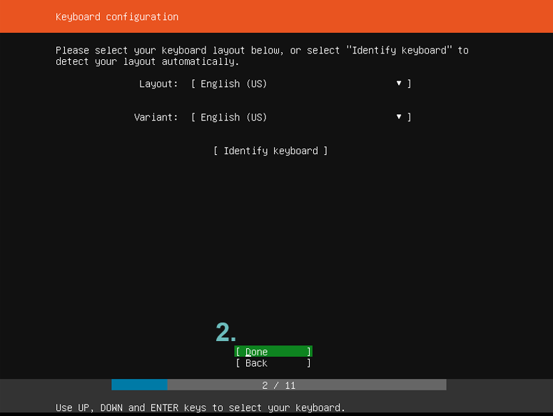

3. Press ‘Enter’ on ‘Install Ubuntu’ to proceed:  

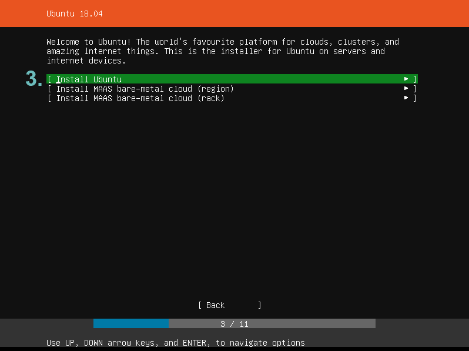

4. This part is for setting Network options, I suggest you leave it on default:  

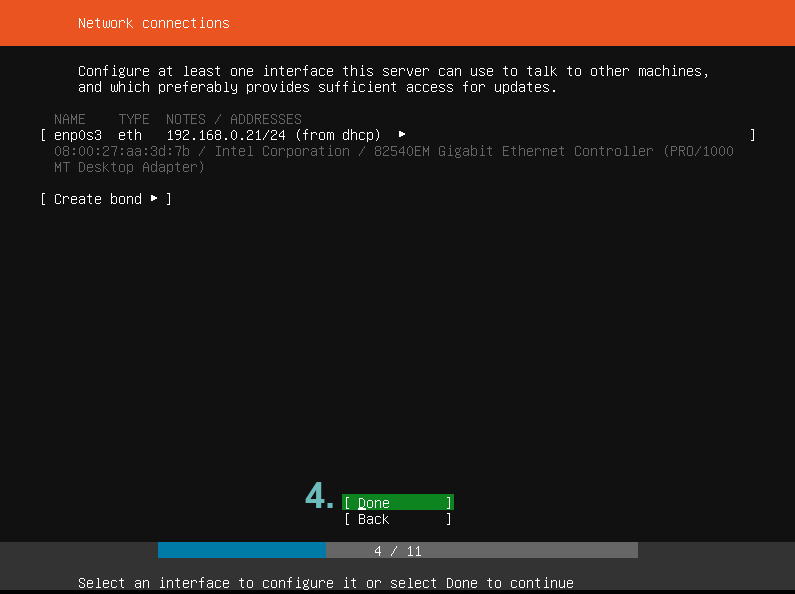

5. Part where you can set Proxy settings, If you’re not using a Proxy to connect to the web, leave it on Default and proceed.  

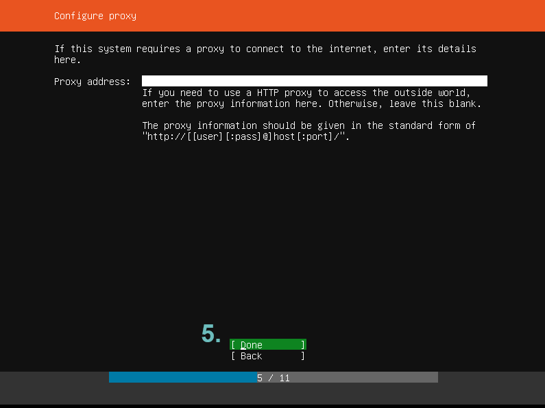

6. On this screen, you choose from where your Ubuntu Server will download it’s packages. Leave it on default and proceed:  

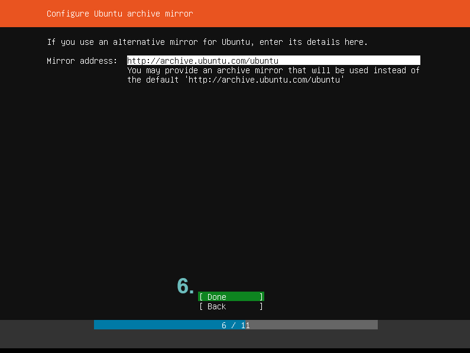

7. Now, you can configure partitioning. If you’re using this machine solely for a node, then select ‘Use an Entire Disk’ and skip to step 12, if you’re installing it on a Virtual Machine, then follow next steps:  

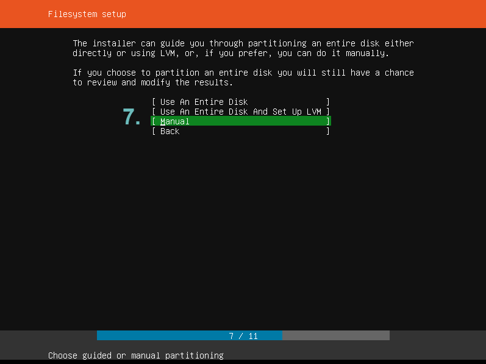

8. Select your Virtual Disk, press ‘Enter’ and on the new window, select ‘Add Partition’ \(8.1\)  

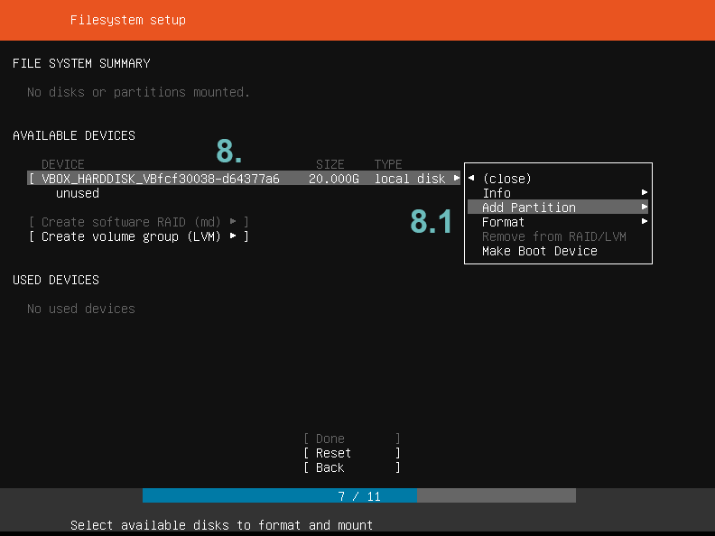

9. Now on this next window, you’re gonna create a ‘swap’ partition. On this Virtual Machine I used 2GB for RAM, so I’m creating the ‘swap’ partition to be 4GB \(Best swap partition size is RAM size + 2GB\), then change ‘Format’ to ‘swap’ as shown on step 9.1  

Once you’re done, select ‘Create’ to continue: 

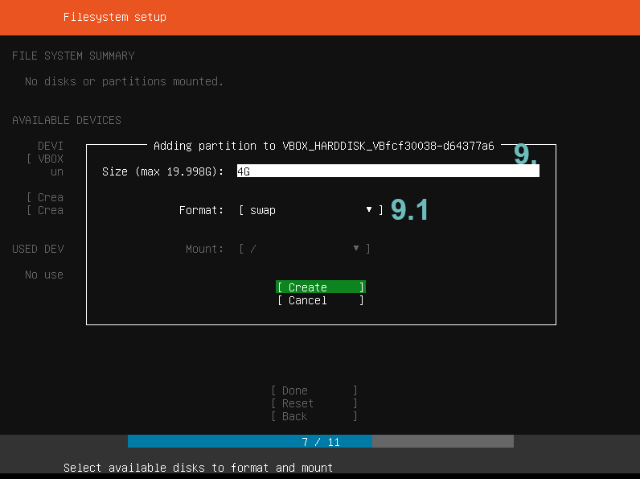

10. Now, add another partition, leave the ‘Size’ field blank and make sure ‘Format’ is set to ‘ext4’ and mount is set to ‘/’, which is root partition. Press ‘Create’ to create root partition.  

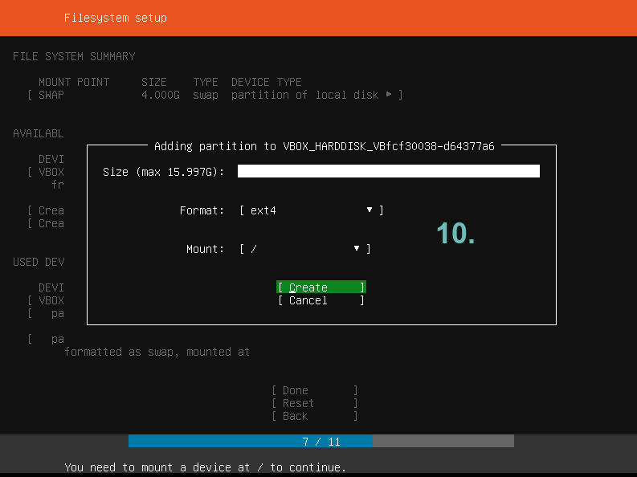

11. Now you have created a ‘swap’ and root ‘/’ partitions, select ‘Done’ to continue and again ‘Continue’ on the new window that pops out.  

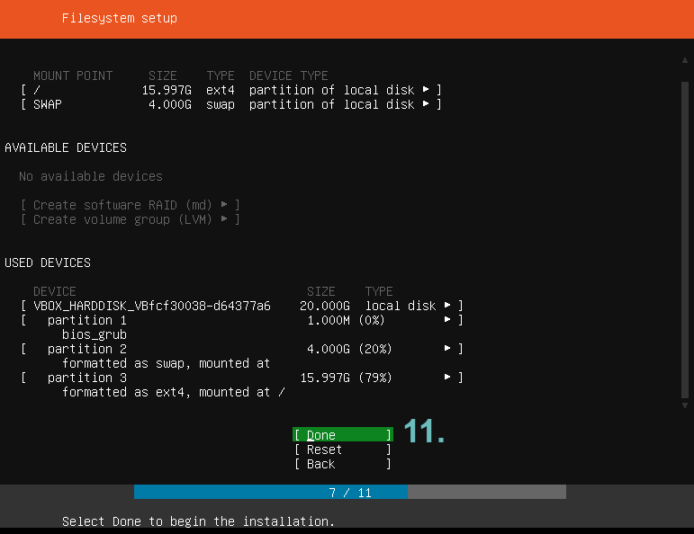

12. On this part, you’re gonna add your information like I’ve did in picture below. Remember your username and password because you will use those on your Ubuntu Server. Leave ‘Import SSH Identity’ at ‘No’ and proceed.  

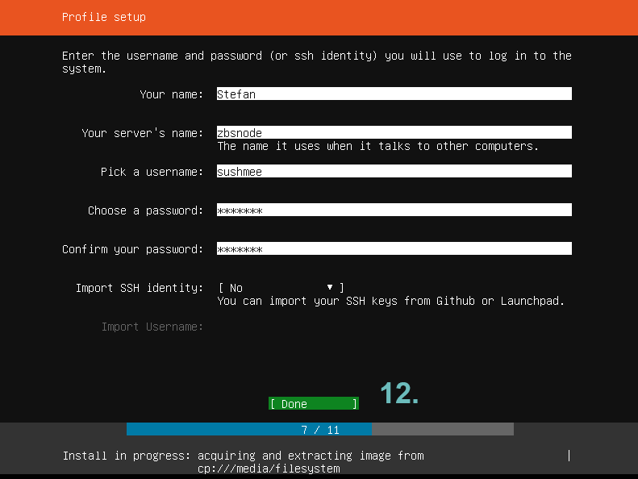

13. On the next screen, right before the actual installation process, it might ask you to choose from Ubuntu’s available Snaps. Don’t select any and proceed and let the installation finish. Once it’s finished, select ‘Reboot Now’ to reboot your machine.  

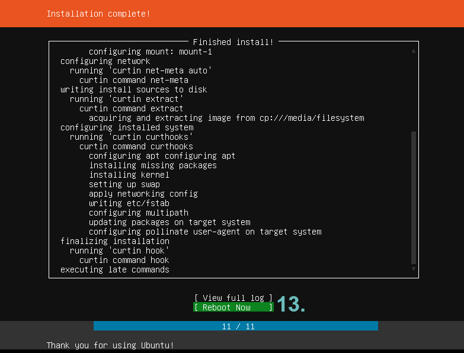

14. When it asks you to remove the installation medium, unplug your bootable USB and press ‘Enter’ \(For VM installation, just press ‘Enter’\) and let it boot.  

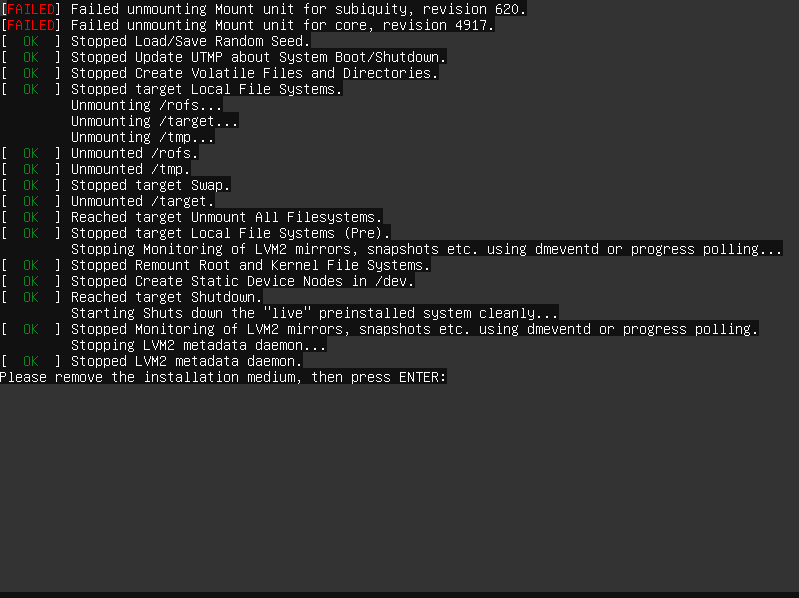

15. If everything’s done properly, you’ll get prompted to login. Use your login credentials which you’ve entered on Step 12. After you’ve logged in, we can start the Node installation!  

