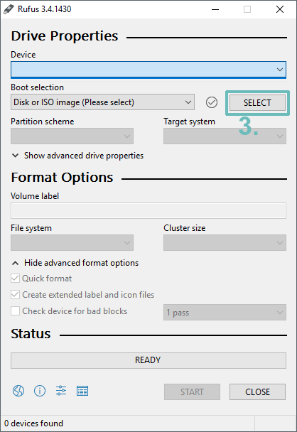

# Making a bootable USB Drive

You will need a program called Rufus, it’s lightweight and easy to use free program used to make bootable USB Drives. I personally use this, but there are bunch of others, so feel free to use any you like. We’ll do this tutorial with Rufus. 

       Rufus download from the official website: [Download](https://rufus.ie/) 

1. Once you’ve downloaded and installed Rufus, open it. You will see this window on your screen:  

2.  Insert your USB Device and select it from the ‘Device’ dropdown menu as shown in the picture:  

3. Once you’ve selected your USB Drive, click on ‘Select’ button to select downloaded Ubuntu Server ISO:  

4. Once you’ve selected it, click on ‘Start’ to start the writing process. Let it finish and then you’re all set to install Ubuntu Server!   

